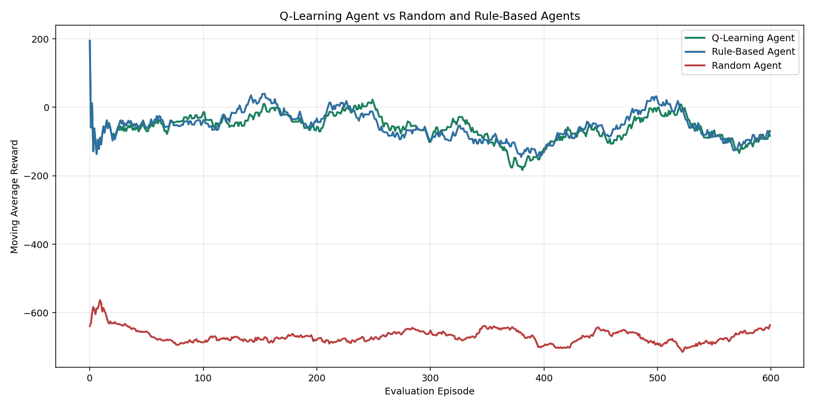
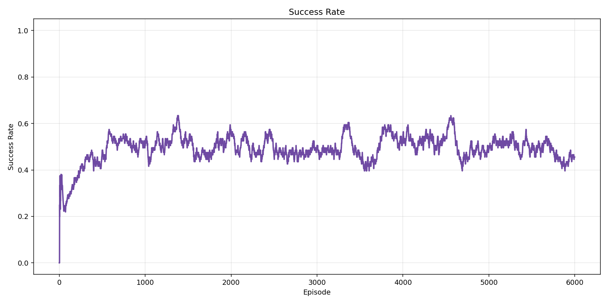
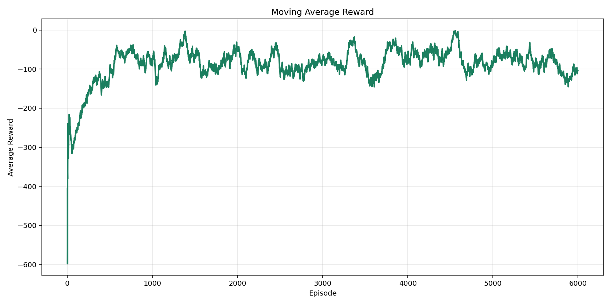
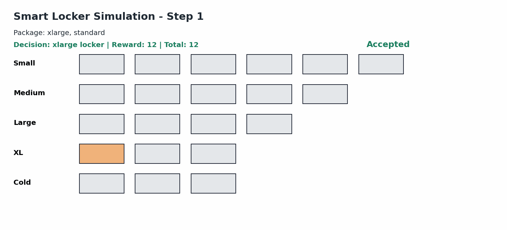

# Smart Locker RL

Q-Learning tabanlı akıllı kargo dolabı yönetim sistemi simülasyonu.

Bu projede reinforcement learning kullanılarak gelen paketlerin küçük, orta ve büyük locker’lara en verimli şekilde yerleştirilmesi amaçlanmıştır. Sistem, gelecekte gelebilecek büyük paketler için büyük locker’ları korumayı öğrenmektedir.

---

# Projenin Amacı

Kargo dolap sistemlerinde farklı boyutlarda locker’lar bulunmaktadır:

- Küçük locker
- Orta locker
- Büyük locker

Amaç:

- Gelen paketleri uygun locker’a yerleştirmek
- Büyük locker’ları gereksiz yere harcamamak
- Uzun vadeli doluluk stratejisi öğrenmek
- Toplam ödülü maksimum yapmak

Bu çalışma reinforcement learning yaklaşımının kaynak yönetimi problemlerinde nasıl kullanılabileceğini göstermek amacıyla geliştirilmiştir.

---

# Kullanılan Yaklaşım

Projede aşağıdaki reinforcement learning yöntemleri kullanılmıştır:

- Q-Learning
- Epsilon-Greedy Exploration
- Reward Engineering
- State Abstraction

Ajan ortamla etkileşime girerek deneme-yanılma yöntemiyle öğrenmektedir.

---

# Problem Tanımı

Sisteme rastgele boyutlarda paketler gelmektedir.

Paket türleri:

- Küçük paket
- Orta paket
- Büyük paket

Ajan her adımda şu kararı vermektedir:

- Paket hangi locker’a yerleştirilmeli?

Yanlış kararlar ileride gelecek büyük paketler için yer kalmamasına neden olabilir.

---

# State (Durum) Tasarımı

Projede state abstraction kullanılmıştır.

Her locker tek tek takip edilmek yerine sadece boş locker sayıları tutulmuştur.

Kullanılan state yapısı:

```python
(
    bos_kucuk,
    bos_orta,
    bos_buyuk,
    gelen_paket
)
```

Örnek:

```python
(3, 5, 2, 0)
```

Anlamı:

- 3 adet boş küçük locker
- 5 adet boş orta locker
- 2 adet boş büyük locker
- gelen paket = küçük paket

---

# Neden State Abstraction Kullanıldı?

Her locker ayrı ayrı takip edilseydi durum uzayı aşırı büyüyecekti.

Örneğin:

```text
15 locker için yaklaşık 2^15 farklı durum oluşabilir.
```

Bu problem reinforcement learning’de “State Space Explosion” olarak bilinmektedir.

Bu nedenle sadece:

- boş locker sayıları
- gelen paket boyutu

takip edilmiştir.

Bu yaklaşım daha küçük ve öğrenilebilir bir state space oluşturmuştur.

---

# Action (Aksiyonlar)

Ajanın 3 farklı aksiyonu bulunmaktadır:

| Aksiyon | Açıklama |
| --- | --- |
| 0 | Küçük locker’a yerleştir |
| 1 | Orta locker’a yerleştir |
| 2 | Büyük locker’a yerleştir |

---

# Reward Fonksiyonu

| Durum | Ödül |
| --- | --- |
| Doğru yerleşim | +10 |
| Bir üst boy locker kullanımı | +3 |
| Büyük locker israfı | -5 |
| Geçersiz hamle | -20 |
| Yer bulunamaması | -50 |

Bu reward yapısı sayesinde ajan büyük locker’ları mümkün olduğunca korumayı öğrenmektedir.

---

# Q-Learning Formülü

Projede klasik Q-Learning güncelleme formülü kullanılmıştır:

```python
Q(s,a) = Q(s,a) + α[r + γ max Q(s',a') - Q(s,a)]
```

Burada:

- α = learning rate
- γ = discount factor

---

# Exploration Stratejisi

Projede epsilon-greedy yaklaşımı kullanılmıştır.

Başlangıçta:

- ajan daha rastgele hareket etmektedir

Eğitim ilerledikçe:

- epsilon değeri düşmektedir
- ajan öğrendiği stratejileri kullanmaya başlamaktadır

Bu sayede exploration ve exploitation dengesi sağlanmıştır.

---

# Eğitim Parametreleri

| Parametre | Değer |
| --- | --- |
| Episode Sayısı | 5000 |
| Learning Rate | 0.1 |
| Discount Factor | 0.9 |
| Başlangıç Epsilon | 0.2 |
| Minimum Epsilon | 0.01 |

Environment küçük bir state space’e sahip olduğu için 5000 episode yeterli performansı sağlamıştır. Yapılan testlerde 10000 episode kullanımının anlamlı bir performans artışı oluşturmadığı gözlemlenmiştir. Bu nedenle eğitim süresi ve performans dengesi açısından 5000 episode tercih edilmiştir.

---

# Proje Yapısı

```text
smart-locker-rl/
│
├── main.py
├── requirements.txt
│
├── src/
│   ├── environment.py
│   ├── agent.py
│   ├── trainer.py
│   └── visualizer.py
│
├── outputs/
│   ├── plots/
│   └── gifs/
```

---

# Eğitim Sonuçları

## Q-Learning vs Random Agent

Eğitilen ajan random karar veren ajana göre çok daha başarılı sonuçlar üretmiştir.



---

## Başarı Oranı

Eğitim sürecinde başarı oranı zamanla yükselmiş ve stabil hale gelmiştir.



---

## Ortalama Ödül Grafiği

Moving average grafiği ajan davranışının zamanla iyileştiğini göstermektedir.



---

# Locker Simülasyonu

Aşağıdaki GIF içerisinde:

- gelen paket
- seçilen locker
- ödül
- locker doluluk durumu

gözlemlenebilmektedir.



---

# Gözlemler

Eğitim sonucunda ajan:

- büyük locker’ları korumayı
- geçersiz hamleleri azaltmayı
- uzun vadeli ödülü artırmayı

başarıyla öğrenmiştir.

Random agent ise çoğunlukla negatif ödül almıştır.

---

# Gelecekte Yapılabilecek Geliştirmeler

Projeye ileride aşağıdaki geliştirmeler eklenebilir:

- Deep Q-Network (DQN)
- Dinamik locker kapasitesi
- Öncelikli paket sistemi
- Gerçek zamanlı dashboard
- Multi-agent sistemler
- Web tabanlı görselleştirme

---

# Kullanılan Teknolojiler

- Python
- NumPy
- Matplotlib
- ImageIO

---

# Sonuç

Bu proje reinforcement learning yöntemlerinin akıllı kaynak yönetimi problemlerinde etkili şekilde kullanılabileceğini göstermektedir.

Q-Learning ajanı zaman içerisinde anlamlı stratejiler öğrenmiş ve random karar veren ajana göre belirgin şekilde daha başarılı sonuçlar üretmiştir.