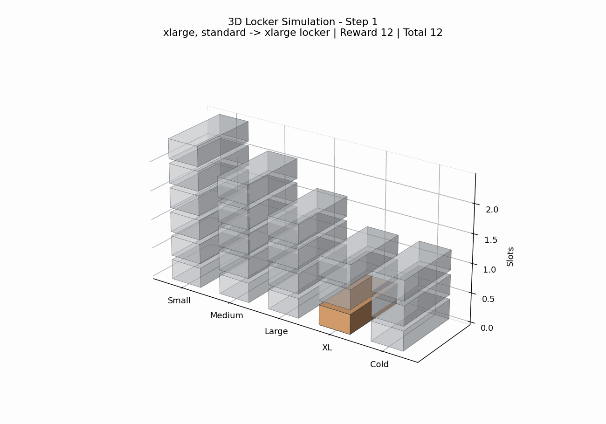
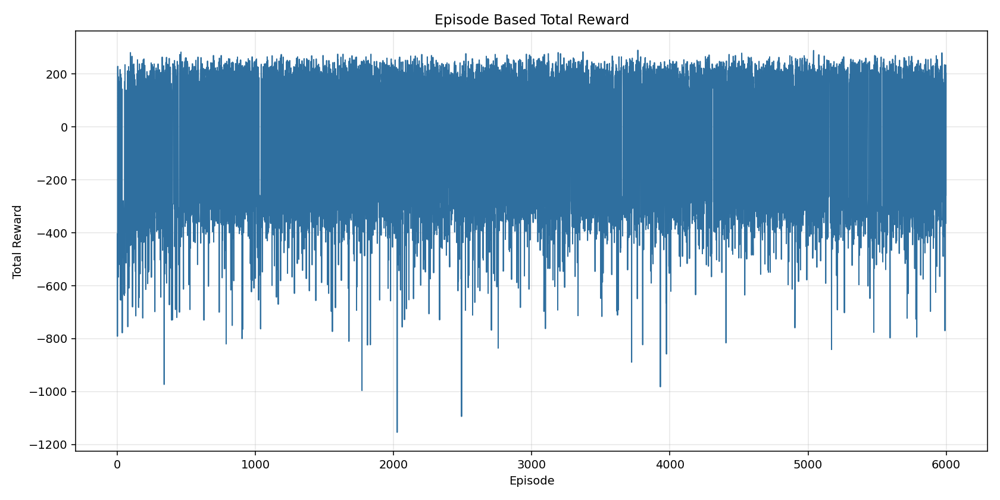
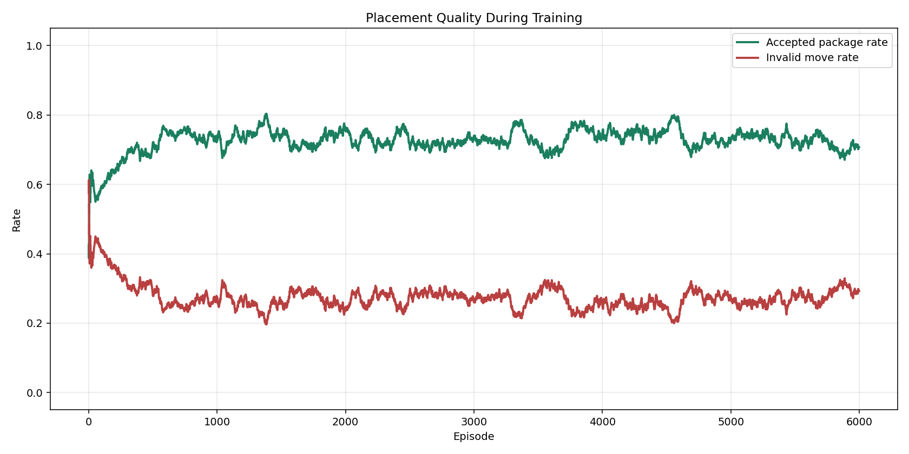
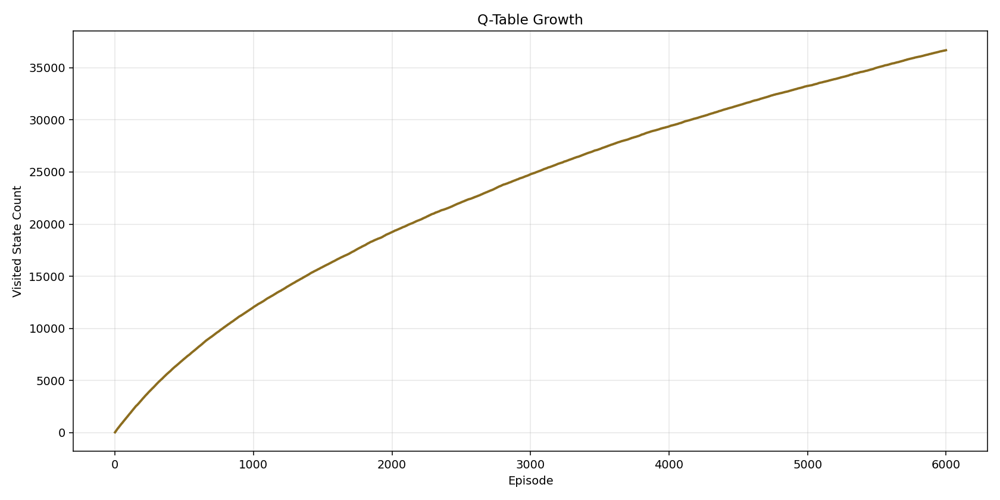
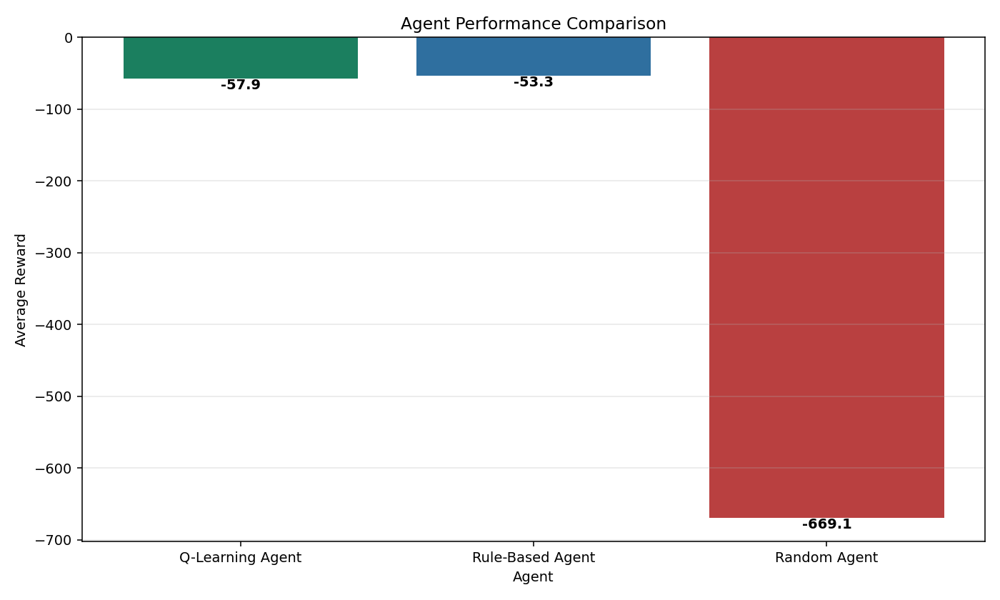
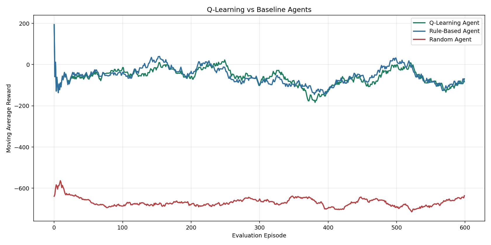

# Smart Locker RL

Q-Learning tabanlı akıllı kargo dolabı yönetim simülasyonu.

Bu projede amaç, farklı boyut ve özelliklerde gelen paketleri sınırlı sayıdaki dolaplara en verimli şekilde yerleştiren bir reinforcement learning ajanı geliştirmektir. İlk sürüm yalnızca küçük, orta ve büyük dolapları dikkate alırken bu sürümde proje daha gerçekçi bir senaryoya taşınmıştır: XL dolaplar, soğuk zincir dolapları, kırılgan paketler, öncelikli teslimatlar ve farklı karar kalitesi metrikleri eklenmiştir.

---

## Proje Özeti

Kargo dolaplarında her dolap tipi sınırlı kapasiteye sahiptir. Gelen paketlerin boyutu ve özel ihtiyaçları değişebilir. Yanlış bir yerleştirme kararı, ileride gelecek daha büyük veya özel koşullu paketler için kaynak kalmamasına neden olabilir.

Bu nedenle ajan yalnızca anlık doğru kararı değil, uzun vadeli dolap kullanım stratejisini de öğrenmeye çalışır.

Projede karşılaştırılan ajanlar:

| Ajan | Açıklama |
| --- | --- |
| Q-Learning Agent | Deneme-yanılma ile Q-tablosu öğrenen ajan |
| Rule-Based Agent | Elle yazılmış sezgisel kurallarla karar veren ajan |
| Random Agent | Tamamen rastgele karar veren referans ajan |

---

## Problem Tanımı

Sisteme farklı özelliklere sahip paketler gelir. Ajan her adımda paketin hangi dolaba yerleştirileceğine karar verir.

Paket özellikleri:

- Boyut: küçük, orta, büyük, XL
- Öncelik: standart, express, acil
- Soğuk zincir ihtiyacı: var/yok
- Kırılganlık: var/yok

Dolap türleri:

- Küçük dolap
- Orta dolap
- Büyük dolap
- XL dolap
- Soğuk zincir dolabı

Temel hedefler:

- Paketi uygun boyuttaki dolaba yerleştirmek
- Büyük ve XL dolapları gereksiz yere harcamamak
- Soğuk zincir paketlerini doğru dolaba yönlendirmek
- Hatalı yerleştirmeleri azaltmak
- Toplam ödülü ve kabul oranını artırmak

---

## Reinforcement Learning Yaklaşımı

Projede tablo tabanlı Q-Learning kullanılmıştır. Ajan, ortamla etkileşime girerek hangi durumda hangi aksiyonun uzun vadede daha iyi olduğunu öğrenir.

Kullanılan teknikler:

- Q-Learning
- Epsilon-Greedy Exploration
- Reward Engineering
- State Abstraction
- Baseline Agent Comparison
- Senaryo tabanlı paket üretimi

Q-Learning güncelleme formülü:

```text
Q(s, a) = Q(s, a) + alpha * [r + gamma * max Q(s', a') - Q(s, a)]
```

Burada:

| Sembol | Anlam |
| --- | --- |
| s | Mevcut durum |
| a | Seçilen aksiyon |
| r | Alınan ödül |
| s' | Sonraki durum |
| alpha | Öğrenme oranı |
| gamma | Gelecekteki ödül katsayısı |

---

## State Tasarımı

Bu projede state abstraction kullanılmıştır. Her dolap tek tek takip edilmek yerine her dolap tipindeki boş kapasite sayısı tutulur.

Yeni state yapısı:

```python
(
    empty_small,
    empty_medium,
    empty_large,
    empty_xlarge,
    empty_cold,
    package_size,
    package_priority,
    cold_required,
    fragile
)
```

Örnek state:

```python
(5, 4, 3, 2, 1, 2, 1, 0, 1)
```

Bu state şu anlama gelir:

- 5 küçük dolap boş
- 4 orta dolap boş
- 3 büyük dolap boş
- 2 XL dolap boş
- 1 soğuk zincir dolabı boş
- Gelen paket büyük
- Paket express öncelikli
- Soğuk zincir gerekmiyor
- Paket kırılgan

---

## Action Tasarımı

Ajanın 5 farklı aksiyonu vardır:

| Aksiyon | Karar |
| --- | --- |
| 0 | Küçük dolaba yerleştir |
| 1 | Orta dolaba yerleştir |
| 2 | Büyük dolaba yerleştir |
| 3 | XL dolaba yerleştir |
| 4 | Soğuk zincir dolabına yerleştir |

---

## Reward Fonksiyonu

Reward fonksiyonu, ajanın yalnızca paketi herhangi bir yere koymasını değil, kaynakları akıllıca yönetmesini hedefler.

| Durum | Etki |
| --- | --- |
| Paketi tam uygun boyuttaki dolaba koymak | Yüksek pozitif ödül |
| Bir üst boy dolap kullanmak | Orta pozitif ödül |
| Gereksiz büyük/XL dolap kullanmak | Ceza |
| Soğuk zincir paketini soğuk dolaba koymak | Ekstra ödül |
| Soğuk zincir paketini normal dolaba koymak | Büyük ceza |
| Geçersiz aksiyon seçmek | Büyük ceza |
| Kırılgan paketi uygun yerleştirmek | Ekstra ödül |
| Acil paketi daha uygun erişilebilir dolaba almak | Ekstra ödül |

Bu yapı sayesinde ajan, anlık yerleştirme başarısının yanında stratejik kapasite korumayı da öğrenir.

---

## Eğitim Parametreleri

| Parametre | Değer |
| --- | --- |
| Episode sayısı | 6000 |
| Maksimum step | 40 |
| Learning rate | 0.1 |
| Discount factor | 0.92 |
| Başlangıç epsilon | 0.35 |
| Minimum epsilon | 0.02 |
| Epsilon decay | 0.996 |

Eğitim sırasında epsilon değeri kademeli olarak azaltılır. Böylece ajan başlangıçta daha fazla keşif yaparken ilerleyen episode'larda öğrendiği Q-değerlerine daha fazla güvenir.

---

## Proje Yapısı

```text
smart-locker-rl/
|
|-- main.py
|-- requirements.txt
|-- README.md
|
|-- src/
|   |-- environment.py
|   |-- agent.py
|   |-- trainer.py
|   |-- visualizer.py
|
|-- outputs/
|   |-- plots/
|   |-- gifs/
|
|-- notebooks/
|   |-- experiment.ipynb
```

---

## Nasıl Çalıştırılır?

Önce bağımlılıkları kurun:

```bash
pip install -r requirements.txt
```

Projeyi çalıştırın:

```bash
python main.py
```

Windows üzerinde projedeki sanal ortamı kullanmak için:

```bash
.\venv\Scripts\python.exe main.py
```

Çalıştırma sonunda grafikler ve simülasyon GIF'leri `outputs/` klasörüne yazılır.

---

## Simülasyon Çıktıları

### 2D Locker Simülasyonu

Aşağıdaki GIF, ajanın her adımda gelen pakete göre hangi dolabı seçtiğini, kararın kabul edilip edilmediğini ve alınan ödülü gösterir.


### 3D Locker Simülasyonu

Bu sürümde ek olarak 3D dolap görünümü de üretilir. Dolap tipleri sütunlar halinde gösterilir ve doluluk seviyeleri üç boyutlu olarak izlenebilir.



---

## Eğitim Grafikleri

### Episode Bazlı Toplam Ödül

Bu grafik, her episode sonunda ajanın aldığı toplam ödülü gösterir. Eğitim başlarında dalgalanma daha fazladır çünkü ajan keşif yapar. Zamanla daha iyi aksiyonlar öğrenildikçe ödül değerleri yükselir.



### Moving Average Ödül Grafiği

Ham ödül grafiği dalgalı olabileceği için hareketli ortalama grafiği modelin genel öğrenme trendini daha net gösterir.


### Başarı Oranı

Başarı oranı, toplam ödülü pozitif olan episode'ların hareketli ortalamasıdır. Bu grafik ajan davranışının zaman içinde daha kararlı hale gelip gelmediğini gösterir.


### Kabul ve Hatalı Hamle Oranı

Bu grafik, eğitim boyunca paket kabul oranı ile geçersiz karar oranını birlikte gösterir. İyi bir ajan, kabul oranını artırırken hatalı hamle oranını düşürmelidir.



### Q-Table Büyümesi

Q-tablosunda ziyaret edilen farklı state sayısını gösterir. Bu grafik, ajanın ortamı ne kadar keşfettiğini anlamak için kullanılır.



---

## Ajan Karşılaştırmaları

### Ortalama Performans Karşılaştırması

Q-Learning Agent, Rule-Based Agent ve Random Agent aynı ortamda test edilir. Bu sayede öğrenen ajanın sadece rastgele ajana değil, basit kural tabanlı bir yaklaşıma karşı da performansı görülebilir.



### Zaman Serisi Karşılaştırması

Aşağıdaki grafik, test episode'ları boyunca ajanların hareketli ortalama ödüllerini karşılaştırır.



Eski sürümle uyumluluk için karşılaştırma grafiği aşağıdaki dosya adıyla da üretilir:


---

## Deney Sonuçları

Çalıştırma sonrasında ajanların özet performansı `outputs/agent_summary.csv` dosyasına yazılır.

Örnek tablo formatı:

```text
Agent,Average Reward,Acceptance Rate,Invalid Move Rate
Q-Learning Agent,...
Rule-Based Agent,...
Random Agent,...
```

Bu çalıştırmada beklenen genel davranış:

- Random Agent çok daha fazla geçersiz hamle yapar.
- Rule-Based Agent, elle yazılmış güçlü bir baseline oluşturur.
- Q-Learning Agent, random ajana göre belirgin şekilde daha iyi performans verir ve rule-based ajana yakın sonuç üretir.
- Genişletilmiş state uzayı daha büyük olduğu için Q-learning performansı eğitim süresi, state abstraction ve reward tasarımına duyarlıdır.

---

## Neler Geliştirildi?

Bu sürümde proje aşağıdaki başlıklarda büyütüldü:

- Paket boyutları 3 sınıftan 4 sınıfa çıkarıldı.
- Soğuk zincir dolabı eklendi.
- Paket önceliği eklendi.
- Kırılgan paket kriteri eklendi.
- Reward fonksiyonu daha gerçekçi hale getirildi.
- Random Agent yanında Rule-Based Agent eklendi.
- Eğitim sırasında kabul oranı ve hatalı hamle oranı takip edildi.
- Q-table büyüme grafiği eklendi.
- 2D simülasyon görselleştirmesi geliştirildi.
- 3D simülasyon GIF'i eklendi.
- GitHub README dosyası proje raporu formatında genişletildi.

---

## Gelecek Geliştirmeler

Projeye ileride şu özellikler eklenebilir:

- Deep Q-Network (DQN)
- Web tabanlı interaktif 3D simülasyon
- Paketlerin dolapta kalma süresi
- Müşteri teslim alma davranışı
- Dinamik yoğunluk senaryoları
- Çoklu dağıtım noktası simülasyonu
- Multi-agent dağıtım stratejileri
- Gerçek zamanlı dashboard

---

## Kullanılan Teknolojiler

- Python
- NumPy
- Matplotlib
- ImageIO

---

## Sonuç

Bu proje, reinforcement learning yaklaşımının kaynak yönetimi problemlerinde nasıl kullanılabileceğini gösteren bir simülasyondur. Genişletilmiş sürümde problem yalnızca boyut eşleştirme olmaktan çıkarılmış; öncelik, soğuk zincir, kırılganlık ve kapasite koruma gibi daha gerçekçi kriterlerle desteklenmiştir.

Sonuç olarak proje, basit bir Q-learning örneğinden daha kapsamlı bir akıllı dolap optimizasyon deneyine dönüştürülmüştür.
